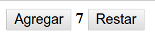
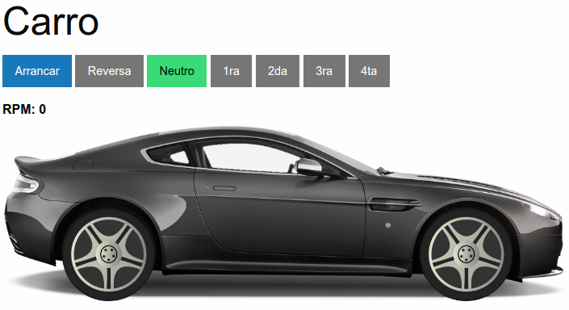
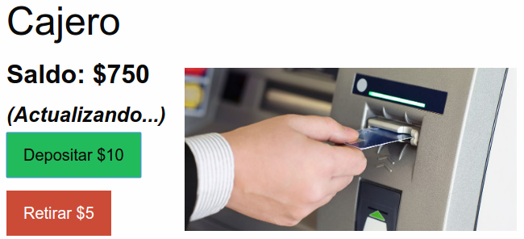
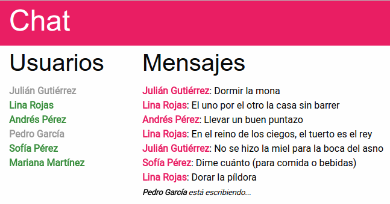

# redux-examples

Serie de ejemplos para aprender [Redux](http://redux.js.org).

Entra al [espacio para prácticar](./play) para aprender.

La serie de React se encuentra en [react-examples](https://github.com/vulcan-estudios/react-examples)
para continuar con el aprendizaje.

## Levels

### Level 0 - [Fundamentos](./level0)

### Level 1 - [Fundamentos](./level1)

### Level 2 - [Middlewares y side-effects](./level2)

### Level 3 - [Multiple reducers](./level3)

## License

[MIT](./LICENSE)
